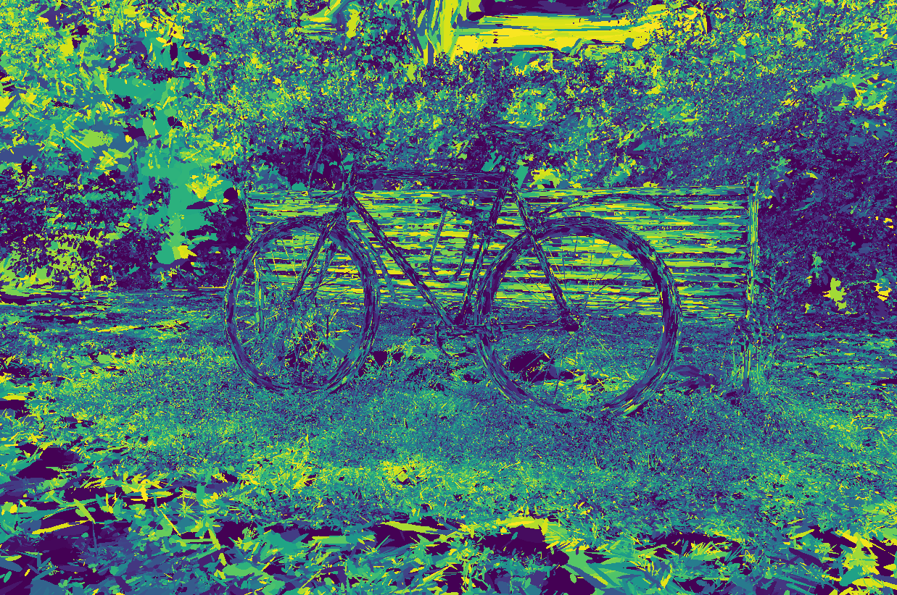
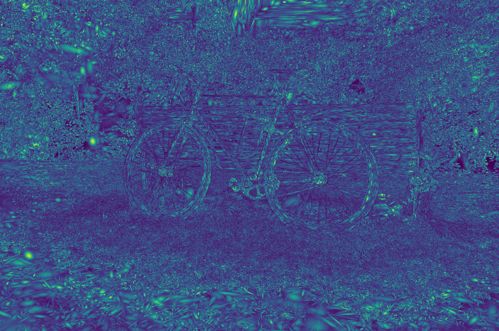

# Differential Gaussian Rasterization with Top-K Contributors & Alpha Weights

This fork remains API-compatible with the original rasterizer, but adds the functionality to **obtain the IDs and alpha blending weights of the Top-K Gaussian splats** contributing to each pixel during rendering. You can drop this repo into any existing 3D Gaussian Splatting project without extra patches—simply rebuild the extension and use the new renderer.

## What’s new

- **Top-K splat contributor tracing** baked directly into the CUDA rasterizer (default `TOPK_CONTRIBUTORS` defined in `cuda_rasterizer/config.h`).
- **Python bindings** exposing the contributor IDs/weights while preserving the original rendering interface.
- **Simple Data Access & Visualization**: You can simply use these data (IDs and weights). I have also performed a simple visualization.

## Visual examples

| Original Render (`assets/render.png`) | Ground Truth (`assets/gt.png`) |
| --- | --- |
|  |  |

| Top-1 Contributor IDs (`assets/topk_contributor.png`) | Top-1 Weights (`assets/topk_weight.png`) |
| --- | --- |
|  |  |

## Usage

1. Build the extension as usual:
   ```bash
   cd submodules/diff-gaussian-rasterization
   pip install -e .
   ```

2.  Replace the usual `rasterizer(...)` call with `rasterizer.forward_with_topk_contributors(...)` to directly obtain `topk_contributors_id` and `topk_contributors_weights`
    ```python
    rendered_image, radii, topk_contributors_id, topk_contributors_weights = rasterizer.forward_with_topk_contributors(
         means3D = means3D,
         means2D = means2D,
         shs = shs,
         colors_precomp = colors_precomp,
         opacities = opacity,
         scales = scales,
         rotations = rotations,
         cov3D_precomp = cov3D_precomp)
    ```
3.  The global Top-K count is controlled via `cuda_rasterizer/config.h` (`TOPK_CONTRIBUTORS`). Adjust that value and rebuild to change how many contributors are recorded.
4.  No other code changes are required; all existing training/inference scripts continue to run unchanged.

## Citation

If you use this customized version, please still cite the original work:

```
@Article{kerbl3Dgaussians,
  author       = {Kerbl, Bernhard and Kopanas, Georgios and Leimk{\"u}hler, Thomas and Drettakis, George},
  title        = {3D Gaussian Splatting for Real-Time Radiance Field Rendering},
  journal      = {ACM Transactions on Graphics},
  number       = {4},
  volume       = {42},
  month        = {July},
  year         = {2023},
  url          = {[https://repo-sam.inria.fr/fungraph/3d-gaussian-splatting/](https://repo-sam.inria.fr/fungraph/3d-gaussian-splatting/)}
}
```
